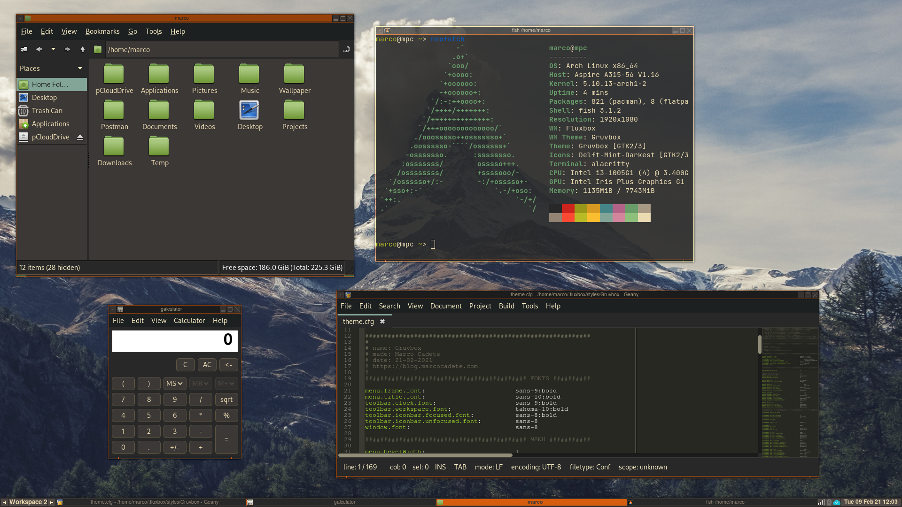

# My Fluxbox config and styles
I use [Fluxbox](http://fluxbox.org/) as my window manager, so all my configurations and styles will be added to this repository. If you're interested in an article I wrote about Fluxbox, you can read it [here](https://blog.marcocadete.com).  

## Styles  

### Gruvbox
A Gruvbox theme for Fluxbox that I created, Inspired by [Gruvbox](https://github.com/morhetz/gruvbox)
#### Menu  

  

#### Toolbar  

  

#### Windows

  

#### GTK theme and Icons

[Gruvbox GTK theme](https://github.com/3ximus/gruvbox-gtk)  

[Delft-Mint-Darkest Icon theme](https://www.gnome-look.org/s/Gnome/p/1199881)
